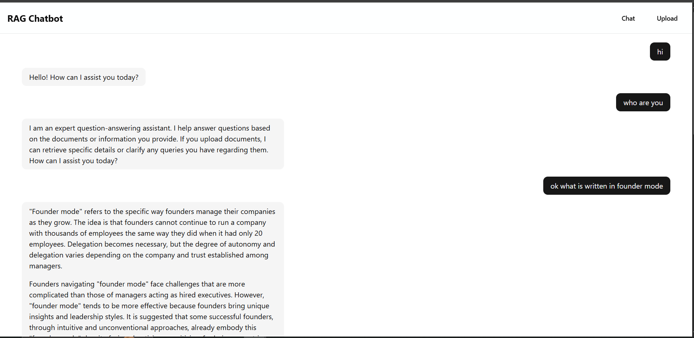
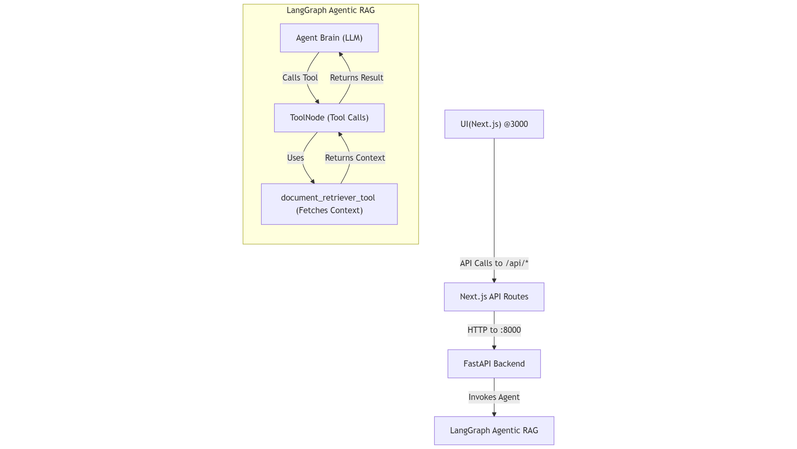
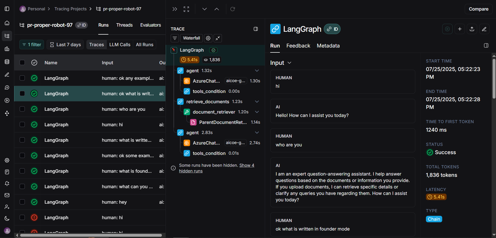
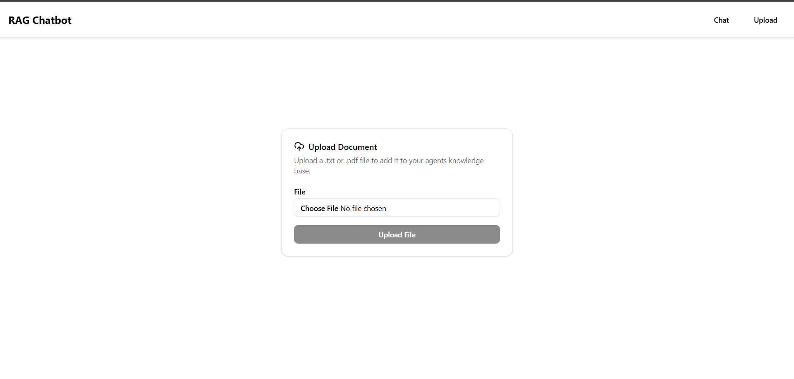

# Agentic RAG Chatbot



This project is a RAG (Retrieval-Augmented Generation) chatbot designed to answer questions based on user-uploaded documents. It is built with a modern stack and features a full retrieval and reasoning pipeline, an observability layer, streamlined deployment process using Docker and a UI .

[Demo Link](https://youtu.be/2dNDOchkO_s)

## Architecture

The agent is built using LangGraph's "Agent with a Tool" paradigm. The core of the agent is an LLM that has access to a `document_retriever` tool. The LLM decides whether to answer directly or use the tool to fetch context from the uploaded documents. Additonally it has a calculator tool that is used for calculation.



---

---

## Tech Stack

| **Category**      | **Technology**                                      |
| ----------------- | --------------------------------------------------- |
| **Backend**       | Python, FastAPI, LangChain, LangGraph, ChromaDB     |
| **Frontend**      | Next.js, React, TypeScript, Tailwind CSS, Shadcn UI |
| **Deployment**    | Docker, Docker Compose                              |
| **Observability** | LangSmith                                           |

---

---

## Features

- **Multi-Tool Agent**: An agent built with LangGraph that can use multiple tools:
  - **Document Retriever**: Answers questions about user-uploaded `.txt` and `.pdf` files.
  - **Calculator**: Solves mathematical problems.
- **RAG Pipeline**: Employs a `ParentDocumentRetriever` for accurate and context-aware answers from the documents.
- **Streaming UI**: A clean, responsive interface built with Next.js and Shadcn UI that streams responses in real-time.
- **Full Observability**: Agent action is traced end-to-end with **LangSmith** for easy debugging and monitoring.
- **Dockerized**: The entire application (frontend and backend) is containerized and runs with a single `docker-compose up` command for easy setup.

---

## Setup and Installation

### Prerequisites

- [Docker](https://docs.docker.com/get-docker/) and [Docker Compose](https://docs.docker.com/compose/install/) installed and running
- [Git](https://git-scm.com/downloads) installed

---

### 1. Clone the Repository

```bash
git clone https://github.com/Sanjay-Ganapathi/teradata-assignment.git
cd
```

---

### 2. Configure Environment Variables

The backend requires API keys to connect to your LLM provider and LangSmith.

1. Navigate to the `be` directory:

   ```bash
   cd be
   ```

2. Create a `.env` file by copying the example:

   ```bash
   cp .env.example .env
   ```

3. Open `.env` and fill in your actual credentials for:

   - LLM provider (I am using Azure OpenAI)
   - LangSmith API key

4. Similarly for frontend copy the contents from `.env.example` to a new file `.env` and fill the values

---

---

## Running the Application

From the root directory of the project, run the following command:

```bash
docker compose up --build
```

This will build the Docker images for both the **frontend** and **backend**, and start the services.

- Frontend: [http://localhost:3000](http://localhost:3000)
- Backend API: [http://localhost:8000](http://localhost:8000)

---

---

## How to Use the Application

1. **Upload a Document**
   Open your browser and navigate to:
   [http://localhost:3000/upload](http://localhost:3000/upload)
   Select a `.txt` or `.pdf` file and click the **"Upload File"** button.

2. **Chat with the Document**
   Navigate to:
   [http://localhost:3000](http://localhost:3000)
   You can now ask questions based on the document you just uploaded.

3. **View Traces**
   After interacting with the chatbot, go to your [LangSmith](https://smith.langchain.com/) project to view a **detailed trace** of the agent’s reasoning and tool usage.

---

---

<br/>

_Langsmith_ -> [Trace](https://smith.langchain.com/public/eceea611-8f9f-450b-9c8b-7529cbe2351b/r)


<br />

_Upload Page_

